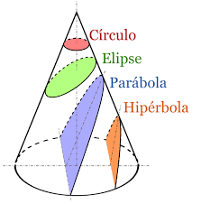
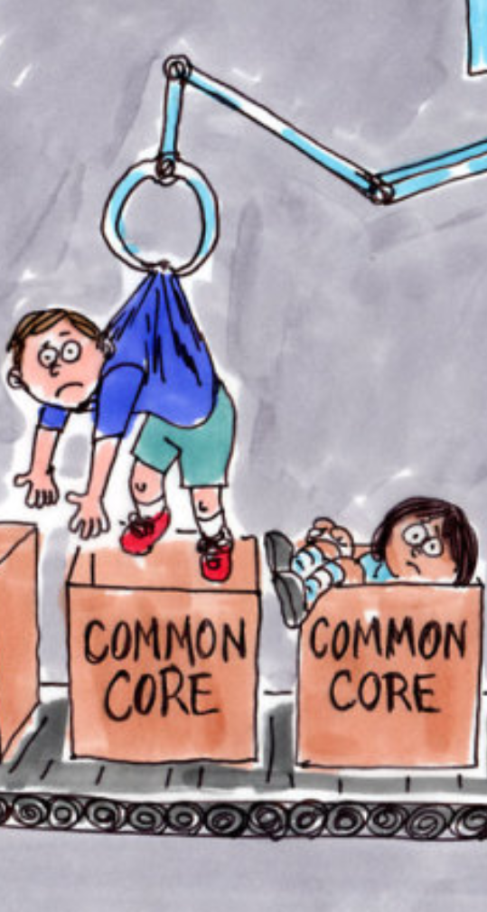
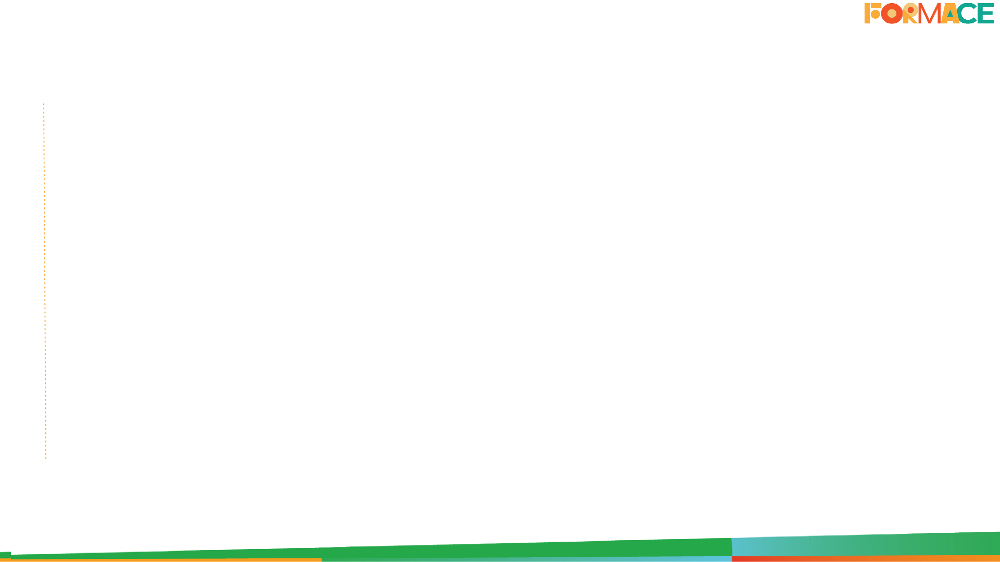
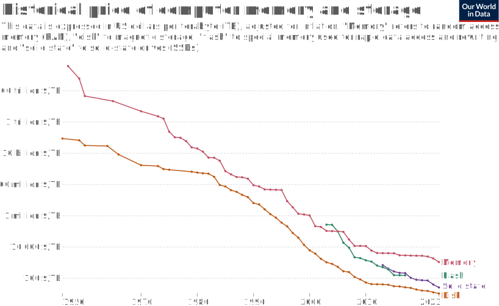
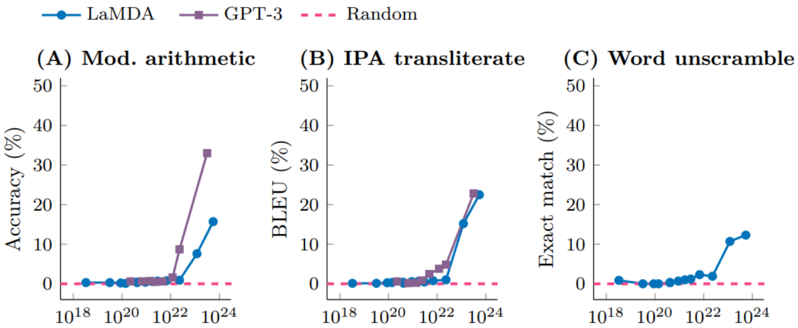

IA & Educação

Aplicações de Modelos  de Linguagem

Michael Souza (UFC)

---

Melhoria vs Transformação

<image src="images/abaco-calculadora.png" style="position: absolute; bottom: 20%; left: 18%; width: 25%;">

<image src="images/globo-youtube.png" style="position: absolute; bottom: 20%; right: 20%; width: 28%;">

  <a href="https://www.jstor.org/stable/1315198" target="_blank" style="color: #4b616b; text-decoration: none;">
    ... What the Success of Chalkboards Tells Us About the Future of Computers ... [Krause, 2000]
  </a>

---

Educação: Conteúdo e Forma

    <ul>
        <li>Em 1825, o quadro negro foi adotado na universidade de Yale.</li>
        <li>Em 1830, os alunos passaram a ser obrigados a reproduzir de memória partes dos livros nos quadros.</li>
    </ul>

    <a href="https://www.cambridgemaths.org/blogs/degenerates/" target="_blank" style="color: #4b616b; text-decoration: none;">
        Conic Sections Rebellion - Degenerates [Lucy Rycroft-Smith, 2018]
    </a>

---

Sonhos Educacionais ...

    <ul>
        <li><em>Educação Inclusiva</em></li>
        <li><em>Descentralização Curricular</em></li>
        <li><em>Avaliações Personalizadas</em></li>
        <li><em>Feedbacks Contínuos</em></li>
    </ul>

<!-- Homework vs Pais iletrados -->
<!-- Capital cultural -->
<!-- Laura leitura e a pandemia -->

---

Efeito Baumol

    <ul>
        <li><em>Custos crescentes sem ganhos de produtividade</em></li>
        <li><em>Impacto na oferta de serviços essenciais</em></li>
    </ul>

  <a href="https://www.vox.com/new-money/2017/5/4/15547364/baumol-cost-disease-explained" target="_blank" style="color: #4b616b; text-decoration: none;">
    William Baumol, whose ... [Lee, 2017]
  </a>

---

<image src="images/bill-gates.png" style="position: absolute; bottom: 10%; right: 0%; height: 40%;">

    Bill Gates 
    Microsoft

Da Curiosidade à Necessidade

“IA é o avanço tecnológico mais significativo desde a interface gráfica. Assim como o microprocessador e a Internet, ela transformará a maneira como trabalhamos, aprendemos, viajamos e nos comunicamos."

<a href="https://www.mckinsey.com/featured-insights/artificial-intelligence/ai-adoption-advances-but-foundational-barriers-remain" target="_blank" style="color: #4b616b; text-decoration: none;">
    The Age of AI has begun [Bill Gates, 2023]
  </a>

---

<image class="shadow" src="images/time-to-100M.jpeg" style="position: absolute; bottom: 15%; right: 17%; width: 60%;">

Tempo para alcançar 100 milhões de usuários

<a href="https://www.mckinsey.com/featured-insights/artificial-intelligence/ai-adoption-advances-but-foundational-barriers-remain" target="_blank" style="color: #4b616b; text-decoration: none;">
    Threads becomes fastest-ever app to surge past 150 MILLION ... [Daily Mail, 2023]
  </a>

---

<image src="images/template-content-small.png" style="position: absolute; top: 0%; left: 0%; width: 100%;">

<image src="images/woman-v3.png" style="position: absolute; bottom: 10%; left: 15%; width: 80%;">

Fev, 2022

Abr, 2022

Jul, 2022

  <a href="https://www.midjourney.com/home" target="_blank" style="color: #4b616b; text-decoration: none;">
    [Midjourney, 2022-2023]
  </a>

---

<image src="images/template-content-small.png" style="position: absolute; top: 0%; left: 0%; width: 100%;">

<image src="images/woman-v4.png" style="position: absolute; bottom: 10%; left: 15%; width: 80%;">

Fev, 2022

Jul, 2022

Jul, 2022

Nov, 2022

  <a href="https://www.midjourney.com/home" target="_blank" style="color: #4b616b; text-decoration: none;">
    [Midjourney, 2022-2023]
  </a>

---

<image src="images/template-content-small.png" style="position: absolute; top: 0%; left: 0%; width: 100%;">

<image src="images/woman-v5.png" style="position: absolute; bottom: 10%; left: 15%; width: 80%;">

Fev, 2022

Nov, 2022

Mai, 2023

  <a href="https://www.midjourney.com/home" target="_blank" style="color: #4b616b; text-decoration: none;">
    [Midjourney, 2022-2023]
  </a>

---

<image src="images/template-content-small.png" style="position: absolute; top: 0%; left: 0%; width: 100%;">

2024

<iframe width="680" height="420" src="images/woman-video-reversed.mp4" title="YouTube video player" frameborder="0" allow="accelerometer; autoplay; clipboard-write; encrypted-media; gyroscope; picture-in-picture; web-share" referrerpolicy="strict-origin-when-cross-origin" allowfullscreen style="position: absolute; top: 25%; left: 25%; border: 2px solid black;"></iframe>

  <a href="https://www.midjourney.com/home" target="_blank" style="color: #4b616b; text-decoration: none;">
    [Runway, 2024]
  </a>

---

<image class="shadow" src="images/deepmind-muzero-upscaling.png" style="position: absolute; bottom: 15%; left: 20%; width: 45%;">

Jan, 2016

Out, 2017

Dec, 2018

Dec, 2020

  <a href="https://deepmind.google/discover/blog/muzero-mastering-go-chess-shogi-and-atari-without-rules/" target="_blank" style="color: #4b616b; text-decoration: none;">
    MuZero: Mastering Go, chess, shogi and Atari without rules [DeepMind, 2020]
  </a>

---

<image class="shadow" src="images/deepmind-muzero-upscaling.png" style="position: absolute; bottom: 15%; left: 20%; width: 45%;">

<image src="images/deepmind-alphafold.png" style="position: absolute; top: 8%; right: 10%; width: 16%;">

Nov, 2020

Jan, 2016

Out, 2017

Dec, 2018

Dec, 2020

"O que nos levou <strong>meses e anos</strong> para fazer, o AlphaFold conseguiu fazer em um <strong>fim de semana</strong>." 
<em>McGeehan, Univ. Portsmouth</em>

  <a href="https://www.nature.com/articles/d41586-020-03348-4" target="_blank" style="color: #4b616b; text-decoration: none;">
    ‘It will change everything’: DeepMind’s AI makes gigantic leap in solving ... [Callaway, 2020]
  </a>

---

A próxima   palavra é?

  <a href="https://writings.stephenwolfram.com/2023/02/what-is-chatgpt-doing-and-why-does-it-work/" target="_blank" style="color: #4b616b; text-decoration: none;">
        What Is ChatGPT Doing … and Why Does It Work? [Stephen Wolfram, 2023]
  </a>

---

Por que agora?

---

  <a href="https://ourworldindata.org/moores-law" target="_blank" style="color: #4b616b; text-decoration: none;">
    Pitfall (1982) vs Tomb Raider (2018)
  </a>

---

  <a href="https://ourworldindata.org/moores-law" target="_blank" style="color: #4b616b; text-decoration: none;">
    Moore's Law [Roser et. al, 2023]
  </a>

---

  <a href="https://ourworldindata.org/moores-law" target="_blank" style="color: #4b616b; text-decoration: none;">
    Moore's Law [Roser et. al, 2023]
  </a>

---

Explosão de Dados

<strong><em>Dados por minuto</em></strong>

  <a href="https://financesonline.com/how-much-data-is-created-every-day/" target="_blank" style="color: #4b616b; text-decoration: none;">
    53 Important Statistics About How Much Data Is Created Every Day in 2024 [Finances Online, 2024]
  </a>

---

Habilidades Emergentes

  <a href="https://arxiv.org/pdf/2206.07682" target="_blank" style="color: #4b616b; text-decoration: none;">
    Emergent Abilities in Large Language Models [Wei et. al, 2022]
  </a>

---

Um mundo pixelado

Os riscos da IA na educação

  - Redução do pensamento crítico 
  - Dependência tecnológica 
  - Imprecisão e viés 
  - Impactos sociais e tecnológicos 

  <a href="https://newlearningonline.com/literacies/chapter-1/socrates-on-the-forgetfulness-that-comes-with-writing" target="_blank" style="color: #4b616b; text-decoration: none;">
    Socrates on the Forgetfulness that Comes with Writing [Plato, 370 a.C.]
  </a>

<!-- Sócrates vs Fedro -->
<!-- Falácia da autoridade -->
<!-- Uma ideia não pode defender a si mesma -->
<!-- Possuir vs saber -->
<!-- Aprendizado vs recordação -->
<!-- Pintura vs escrita -->

---

