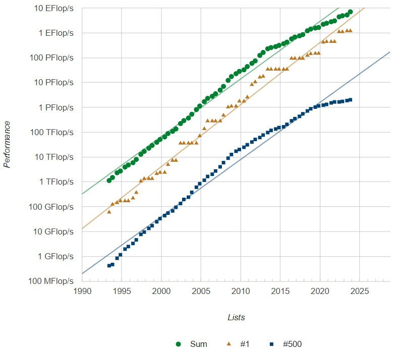

IA & Educação

Aplicações de Modelos  de Linguagem

Michael Souza (UFC)

---

Da Curiosidade à Necessidade

“IA é o avanço tecnológico mais significativo desde a interface gráfica. Assim como o microprocessador e a Internet, ela transformará a maneira como trabalhamos, aprendemos, viajamos e nos comunicamos."

<a href="https://www.mckinsey.com/featured-insights/artificial-intelligence/ai-adoption-advances-but-foundational-barriers-remain" target="_blank" style="color: #4b616b; text-decoration: none;">
    The Age of AI has begun [Bill Gates, 2023]
  </a>

---

Educação: Conteúdo e Forma

    <ul>
        <li>Em 1825, o quadro negro foi adotado na universidade de Yale.</li>
        <li>Em 1830, os alunos passaram a ser obrigados a reproduzir de memória partes dos livros nos quadros.</li>
    </ul>

    <a href="https://www.cambridgemaths.org/blogs/degenerates/" target="_blank" style="color: #4b616b; text-decoration: none;">
        Conic Sections Rebellion - Degenerates [Lucy Rycroft-Smith, 2018]
    </a>

---

Aprimoramento vs Transformação

    <ul>
        <li> Enhancement makes existing practices more efficient without fundamentally them. Technology is a tool that assist in delivering the same content more effectively.</li>
        <li>Transformation happens when a new technology not only assists with existing tasks but also changes the nature of those tasks or introduces entirely new educational methods.
    </ul>

  <a href="https://www.jstor.org/stable/1315198" target="_blank" style="color: #4b616b; text-decoration: none;">
    ... What the Success of Chalkboards Tells Us About the Future of Computers ... [Krause, 2000]
  </a>

---

Universalizar vs. Pasteurizar

    <ul>
        <li><em>Descentralização Curricular</em></li>
        <li><em>Educação Inclusiva</em></li>
        <li><em>Avaliações Personalizadas</em></li>
        <li><em>Feedbacks Contínuos</em></li>
    </ul>

---

Efeito Baumol

    <ul>
        <li><em>Aumento de Salários em Setores de Baixa Produtividade</em></li>
        <li><em>Custos Crescentes Sem Ganhos de Produtividade</em></li>
        <li><em>Impacto nos Serviços Essenciais</em></li>
    </ul>

---

PNL: Problema Fundamental

    <ul>
        <li>Tradução de texto</li>
        <li>Correção gramatical</li>
        <li>Sumarização de texto</li>
        <li>Extração de informações</li>
    </ul>
    A abordagem tradicional é treinar uma rede neural para cada tarefa específica, utilizando grandes quantidades de dados rotulados.

  <a href="https://splab.sdu.edu.cn/GPT3.pdf" target="_blank" style="color: #4b616b; text-decoration: none;">
    Language Models are Few-Shot Learners [Brown et al., 2020]
  </a>

---

PNL: Tradução

  <a href="https://splab.sdu.edu.cn/GPT3.pdf" target="_blank" style="color: #4b616b; text-decoration: none;">
    Language Models are Few-Shot Learners [Brown et al., 2020]
  </a>

---

PNL: Tradução

  <a href="https://splab.sdu.edu.cn/GPT3.pdf" target="_blank" style="color: #4b616b; text-decoration: none;">
    Language Models are Few-Shot Learners [Brown et al., 2020]
  </a>

---

PNL: Tradução

  <a href="https://splab.sdu.edu.cn/GPT3.pdf" target="_blank" style="color: #4b616b; text-decoration: none;">
    Language Models are Few-Shot Learners [Brown et al., 2020]
  </a>

---

A próxima   palavra é?

    
O problema de determinar a próxima palavra é um problema de trajetória.

  <a href="https://writings.stephenwolfram.com/2023/02/what-is-chatgpt-doing-and-why-does-it-work/" target="_blank" style="color: #4b616b; text-decoration: none;">
        What Is ChatGPT Doing … and Why Does It Work? [Stephen Wolfram, 2023]
  </a>

---

Redes Neurais

    
Existem diferentes (forma e tamanho) arquiteturas de redes neurais.

    
Cada uma é mais adequada para um tipo de problema (regressão, classificação, etc).

  <a href="https://www.asimovinstitute.org/neural-network-zoo/" target="_blank" style="color: #4b616b; text-decoration: none;">
        The Neural Network Zoo [Fjodor Van Veen, 2016]
  </a>

---

Palavras vs. Números

    
Redes neurais lidam com números, não com palavras.

    
Desejamos uma representação que seja

    
<strong><em>útil = semântica + aritmética</em></strong>

  <a href="https://www.asimovinstitute.org/neural-network-zoo/" target="_blank" style="color: #4b616b; text-decoration: none;">
        Über formal unentscheidbare Sätze der Principia Mathematica und verwandter .. [Kurt Gödel, 1931]
  </a>

---

Word Embeddings

  <a href="https://www.jmlr.org/papers/volume3/bengio03a/bengio03a.pdf" target="_blank" style="color: #4b616b; text-decoration: none;">
        A Neural Probabilistic Language Model [Bengio et al., 2003]
  </a>

---

Explosão de Modelos de Linguagem

  <a href="https://arxiv.org/pdf/2304.13712" target="_blank" style="color: #4b616b; text-decoration: none;">
    Harnessing the Power of LLMs in Practice: A Survey on ChatGPT and Beyond [Yang et. al, 2023]
  </a>

---

---

---

Arquitetura de um LLM

Attention is all you need

    <ul>
        <li>Camadas de atenção</li>
        <li>Camadas de feedforward</li>
        <li>Camadas de normalização</li>
    </ul>

  <a href="https://arxiv.org/pdf/1706.03762" target="_blank" style="color: #4b616b; text-decoration: none;">
    Attention is All You Need [Vaswani et al., 2017]
  </a>

---

Habilidades Emergentes

<src img="images/emergent-abilities.png" style="position: absolute; top: 20%; right: 5%; height: 70%;">

    Uma habilidade emergente se não está presente em um modelo menor, mas aparece em um modelo maior.

  <a href="https://arxiv.org/pdf/2206.07682" target="_blank" style="color: #4b616b; text-decoration: none;">
    Emergent Abilities in Large Language Models [Wei et. al, 2022]
  </a>

---

Um mundo pixelado

Os riscos da adoção de IA na educação
 

    <ul>
        <li>Redução do pensamento crítico</li>
        <li>Dependência tecnológica</li> 
        <li>Imprecisão e viés</li>
        <li>Impactos sociais e tecnológicos</li>
    </ul>

---

A era da IA

---

---
