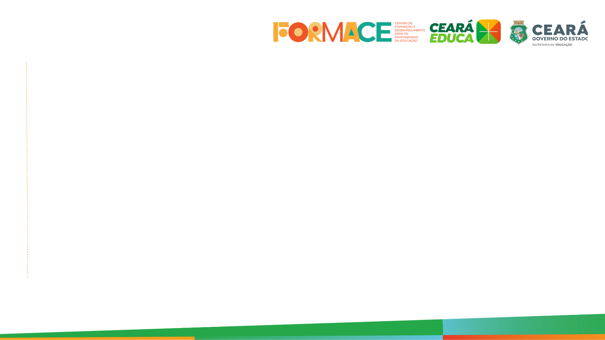
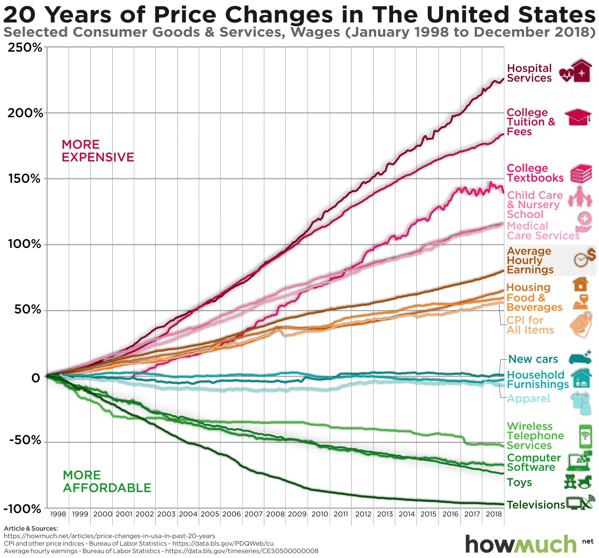
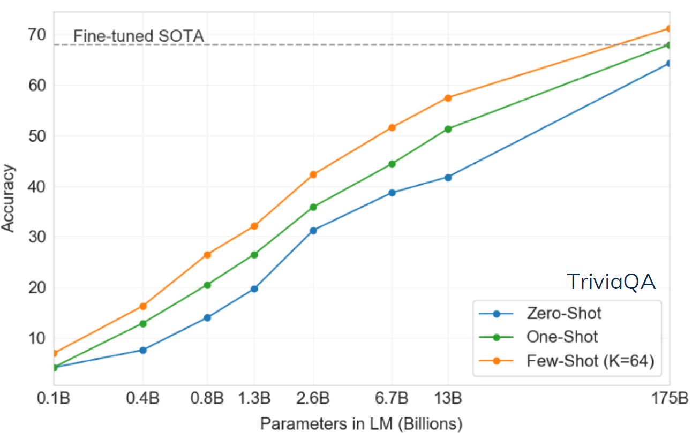
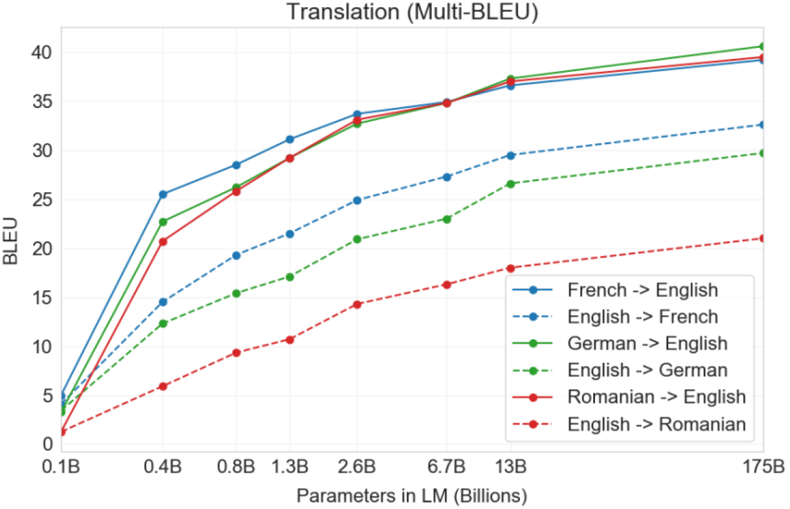
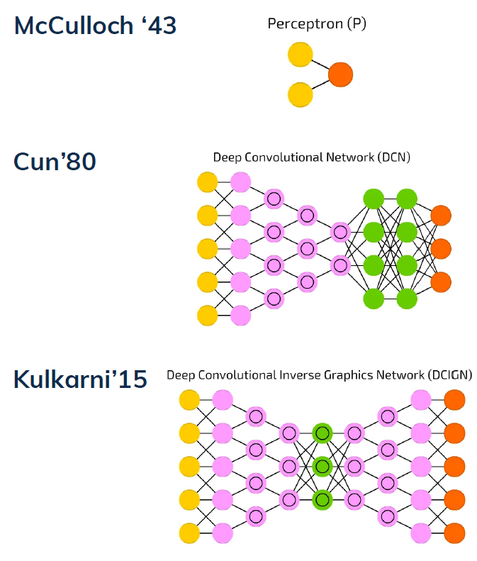
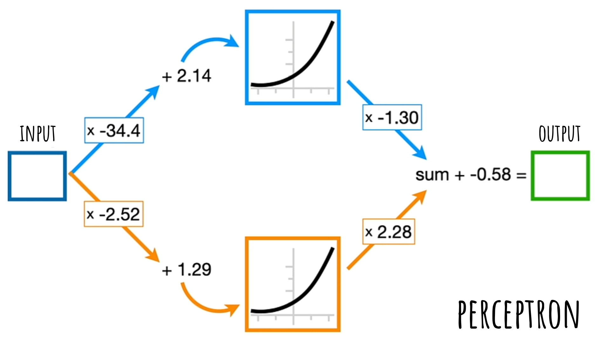
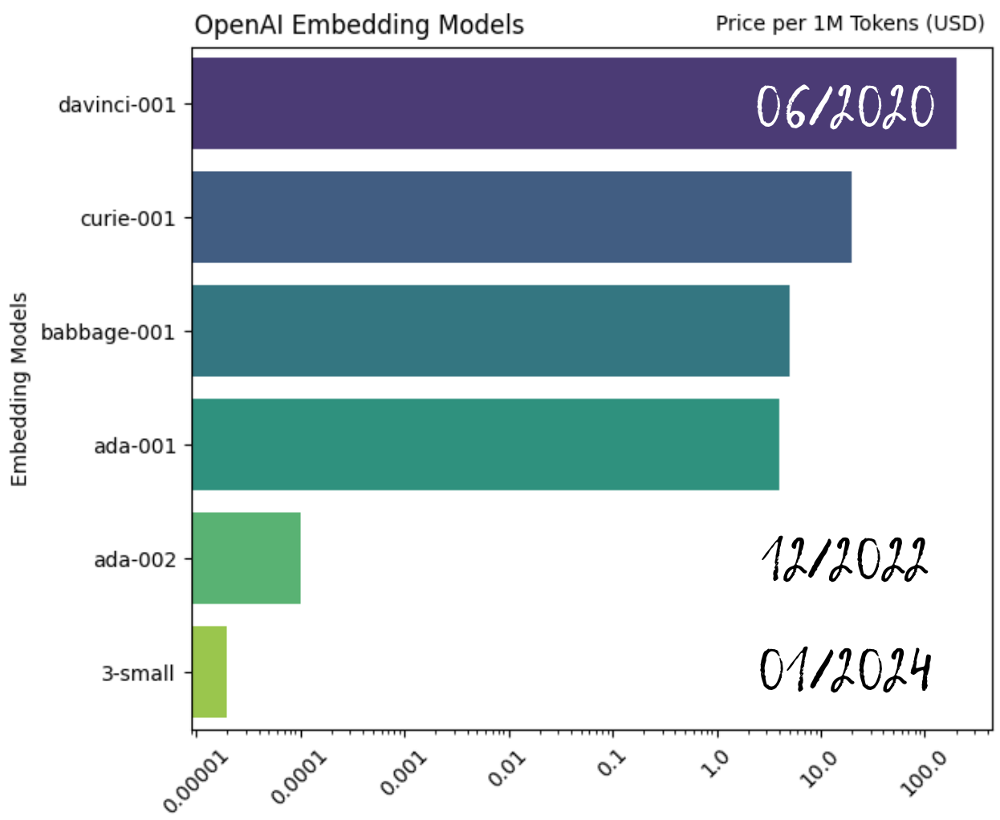

IA & Educação

Aplicações de Modelos  de Linguagem

Michael Souza (UFC)

---

<image src="images/bill-gates.png" style="position: absolute; bottom: 10%; right: 0%; height: 40%;">

Da Curiosidade à Necessidade

“IA é o avanço tecnológico mais significativo desde a interface gráfica. Assim como o microprocessador e a Internet, ela transformará a maneira como trabalhamos, aprendemos, viajamos e nos comunicamos."

<a href="https://www.mckinsey.com/featured-insights/artificial-intelligence/ai-adoption-advances-but-foundational-barriers-remain" target="_blank" style="color: #4b616b; text-decoration: none;">
    The Age of AI has begun [Bill Gates, 2023]
  </a>

---

Educação: Conteúdo e Forma

    <ul>
        <li>Em 1825, o quadro negro foi adotado na universidade de Yale.</li>
        <li>Em 1830, os alunos passaram a ser obrigados a reproduzir de memória partes dos livros nos quadros.</li>
    </ul>

    <a href="https://www.cambridgemaths.org/blogs/degenerates/" target="_blank" style="color: #4b616b; text-decoration: none;">
        Conic Sections Rebellion - Degenerates [Lucy Rycroft-Smith, 2018]
    </a>

---

Melhoria vs Transformação

    <ul>
        <li> A <strong><em>melhoria</em></strong> torna as práticas existentes mais eficientes sem alterá-las fundamentalmente. A tecnologia é uma ferramenta que ajuda a entregar o mesmo conteúdo de forma mais eficaz.</li>
        <li>A <strong><em>transformação</em></strong> ocorre quando uma nova tecnologia não apenas auxilia nas tarefas existentes, mas também muda a natureza dessas tarefas.
    </ul>

  <a href="https://www.jstor.org/stable/1315198" target="_blank" style="color: #4b616b; text-decoration: none;">
    ... What the Success of Chalkboards Tells Us About the Future of Computers ... [Krause, 2000]
  </a>

---

Universalizar vs. Pasteurizar

    <ul>
        <li><em>Descentralização Curricular</em></li>
        <li><em>Educação Inclusiva</em></li>
        <li><em>Avaliações Personalizadas</em></li>
        <li><em>Feedbacks Contínuos</em></li>
    </ul>

---

Efeito Baumol

    <ul>
        <li><em>Custos crescentes sem ganhos de produtividade</em></li>
        <li><em>Impacto na oferta de serviços essenciais</em></li>
    </ul>

---

IA na Educação (GPT4-o, Sal & Imran Khan)

<iframe width="560" height="315" src="https://www.youtube.com/embed/IvXZCocyU_M?si=6cdc_fGDGVXgZcL6" title="YouTube video player" frameborder="0" allow="accelerometer; autoplay; clipboard-write; encrypted-media; gyroscope; picture-in-picture; web-share" referrerpolicy="strict-origin-when-cross-origin" allowfullscreen></iframe>

---

<image src="images/khanmigo.png" style="position: absolute; top: 0%; left: 0%; height: 100%;">

 "Com o Khanmigo, os educadores podem acessar (um banco de dados de) problemas recomendados para os alunos, analisar tendências da turma e simplificar tarefas administrativas, economizando tempo valioso e permitindo que a atenção seja focada nas necessidades dos alunos." 
 <strong><em>Sal Khan</em></strong>

  <a href="https://www.nps.k12.nj.us/press-releases/bill-gates-visits-first-avenue-school-commends-innovative-use-of-technology/" target="_blank" style="color: #4b616b; text-decoration: none;">
    Bill Gates Visits First Avenue School: Commends Innovative Use of Technology [NPS, 2024]
  </a>

---

<image src="images/logo-first-avenue-school.svg" style="position: absolute; top: 30%; right: 5%; height: 50%;;">

First Avenue School

    <ul>
        <li>1.081 alunos</li>
        <li>98% minorias, 86% econ. desfavorecidos</li>
        <li>Relação aluno-professor: 15:1</li>
        <li>Atende do PK (4 anos) ao 8º ano</li>
        <li>Proficiência   21% matemática, 36% leitura</li>        
    </ul>

  <a href="https://www.nps.k12.nj.us/01A/news/first-avenue-school-makes-u-s-news-rankings-for-2024/" target="_blank" style="color: #4b616b; text-decoration: none;">
    First Avenue School Makes U.S. News Rankings for 2024 [NPS, 2024]
  </a>

---

<image src="images/ai-classroom.png" style="position: absolute; top: 30%; right: 5%; height: 50%; border-radius: 15px; box-shadow: 0 4px 8px rgba(0, 0, 0, 0.2);">

Limitações

    <ul>
        <li>Erros na Resolução de Problemas</li>
        <li>Ajuda excessiva durante as avaliações</li>
        <li>Alinhamento com as práticas educacionais</li>
        <li>Mais treinamento para professores</li>
    </ul>

  <a href="https://mosaic.nj.com/news/2024/05/newark-public-schools-among-1st-in-us-to-pilot-new-ai-tutor.html" target="_blank" style="color: #4b616b; text-decoration: none;">
    Newark Public Schools Among 1st in US to Pilot New AI Tutor [Mosaic, 2024]
  </a>

---

PNL: Problema Fundamental

<image src="images/stem-cell.png" style="position: absolute; top: 20%; right: 5%; height: 50%;">

    <ul>
        <li>Tradução de texto</li>
        <li>Correção gramatical</li>
        <li>Sumarização de texto</li>
        <li>Extração de informações</li>
    </ul>
    A abordagem tradicional é treinar uma rede neural para cada tarefa específica, utilizando grandes quantidades de dados rotulados.

  <a href="https://splab.sdu.edu.cn/GPT3.pdf" target="_blank" style="color: #4b616b; text-decoration: none;">
    Language Models are Few-Shot Learners [Brown et al., 2020]
  </a>

---

PNL: QA

  <a href="https://splab.sdu.edu.cn/GPT3.pdf" target="_blank" style="color: #4b616b; text-decoration: none;">
    Language Models are Few-Shot Learners [Brown et al., 2020]
  </a>

---

PNL: Tradução

  <a href="https://splab.sdu.edu.cn/GPT3.pdf" target="_blank" style="color: #4b616b; text-decoration: none;">
    Language Models are Few-Shot Learners [Brown et al., 2020]
  </a>

---

PNL: Tradução

  <a href="https://splab.sdu.edu.cn/GPT3.pdf" target="_blank" style="color: #4b616b; text-decoration: none;">
    Language Models are Few-Shot Learners [Brown et al., 2020]
  </a>

---

A próxima   palavra é?

    
O problema de determinar a próxima palavra é um problema de trajetória.

  <a href="https://writings.stephenwolfram.com/2023/02/what-is-chatgpt-doing-and-why-does-it-work/" target="_blank" style="color: #4b616b; text-decoration: none;">
        What Is ChatGPT Doing … and Why Does It Work? [Stephen Wolfram, 2023]
  </a>

---

Por que agora?

    
- Algoritmos aprimorados

    
- Poder de computação acessível
    
    
- Grandes quantidades de dados
    

---

Redes Neurais

    
Existem diferentes arquiteturas (forma e tamanho) de redes neurais.

    
Cada uma é mais adequada para um tipo de problema (regressão, classificação, etc).

  <a href="https://www.asimovinstitute.org/neural-network-zoo/" target="_blank" style="color: #4b616b; text-decoration: none;">
        The Neural Network Zoo [Fjodor Van Veen, 2016]
  </a>

---

Redes Neurais

  <a href="https://statquest.org/video-index/#:~:text=Neural%20Networks%2C%20Deep%20Learning%2C%20and%20AI" target="_blank" style="color: #4b616b; text-decoration: none;">
        Neural Networks, Deep Learning, and AI [StatQuest with Josh Starmer, 2020]
  </a>

---

Attention is all you need

  - Rede neural que aprende a atenção 
  - Massivamente paralela  
  - Arquitetura de codificador-decodificador 

  <a href="https://arxiv.org/pdf/1706.03762" target="_blank" style="color: #4b616b; text-decoration: none;">
    Attention is All You Need [Vaswani et al., 2017]
  </a>

---

Palavras vs. Números

    
Redes neurais lidam com números, não com palavras.

    
Desejamos uma representação que seja

    
<strong><em>útil = semântica + aritmética</em></strong>

  <a href="https://www.asimovinstitute.org/neural-network-zoo/" target="_blank" style="color: #4b616b; text-decoration: none;">
        Über formal unentscheidbare Sätze der Principia Mathematica und verwandter .. [Kurt Gödel, 1931]
  </a>

---

s

Word Embeddings

  <a href="https://www.jmlr.org/papers/volume3/bengio03a/bengio03a.pdf" target="_blank" style="color: #4b616b; text-decoration: none;">
        A Neural Probabilistic Language Model [Bengio et al., 2003]
  </a>

---

  <a href="https://ourworldindata.org/moores-law" target="_blank" style="color: #4b616b; text-decoration: none;">
    Moore's Law [Roser et. al, 2023]
  </a>

---

  <a href="https://ourworldindata.org/moores-law" target="_blank" style="color: #4b616b; text-decoration: none;">
    Moore's Law [Roser et. al, 2023]
  </a>

---

Explosão de Dados

  <a href="https://financesonline.com/how-much-data-is-created-every-day/" target="_blank" style="color: #4b616b; text-decoration: none;">
    53 Important Statistics About How Much Data Is Created Every Day in 2024 [Finances Online, 2024]
  </a>

---

Explosão de Dados

  <a href="https://www.statista.com/statistics/871513/worldwide-data-created/" target="_blank" style="color: #4b616b; text-decoration: none;">
    Volume of data/information created, captured, copied, and consumed ... [Statista, 2024]
  </a>

---

Explosão de  Modelos de Linguagem

  <a href="https://arxiv.org/pdf/2304.13712" target="_blank" style="color: #4b616b; text-decoration: none;">
    Harnessing the Power of LLMs in Practice: A Survey on ChatGPT and Beyond [Yang et. al, 2023]
  </a>

---

Habilidades Emergentes

  <a href="https://arxiv.org/pdf/2206.07682" target="_blank" style="color: #4b616b; text-decoration: none;">
    Emergent Abilities in Large Language Models [Wei et. al, 2022]
  </a>

---

  <a href="https://lmarena.ai/" target="_blank" style="color: #4b616b; text-decoration: none;">
    LLM Arena # Leaderboard, 27/08/2024
  </a>

---

Um mundo pixelado

Os riscos da IA na educação
 

  - Redução do pensamento crítico 
  - Dependência tecnológica 
  - Imprecisão e viés 
  - Impactos sociais e tecnológicos 

---

