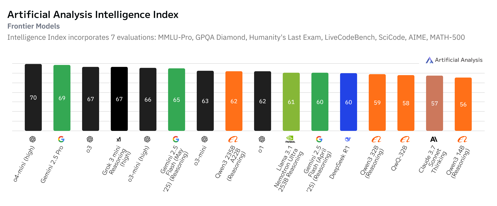
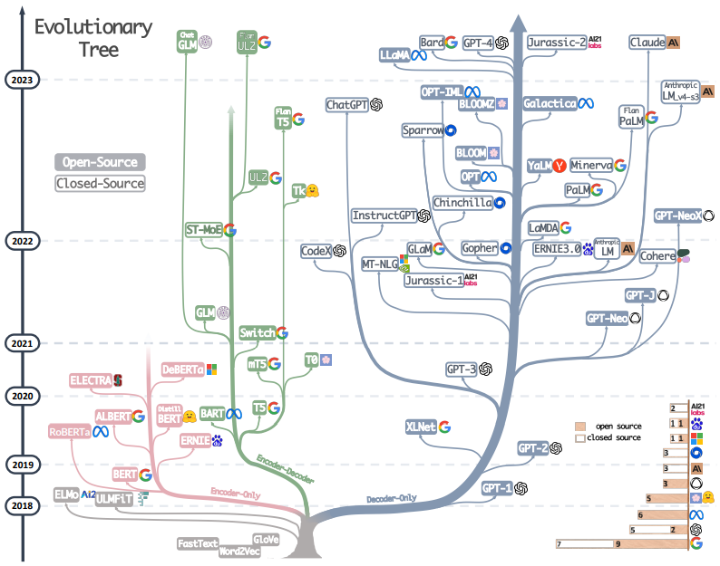

COINPI/2025

IA na Vida Acadêmica  e Pesquisa Ciêntifica

Michael Souza (UFC)

---

<image src="images/bill-gates.png" style="position: absolute; bottom: 10%; right: 0%; height: 40%;">

    Bill Gates 
    Microsoft

B

Da Curiosidade à Necessidade

“IA é o avanço tecnológico mais significativo desde a interface gráfica. Assim como o microprocessador e a Internet, ela transformará a maneira como trabalhamos, aprendemos, viajamos e nos comunicamos."

<a href="https://www.mckinsey.com/featured-insights/artificial-intelligence/ai-adoption-advances-but-foundational-barriers-remain" target="_blank" style="color: #4b616b; text-decoration: none;">
    The Age of AI has begun [Bill Gates, 2023]
  </a>

---

<image class="shadow" src="images/deepmind-muzero-upscaling.png" style="position: absolute; bottom: 15%; left: 20%; width: 45%;">

Jan, 2016

Out, 2017

Dec, 2018

Dec, 2020

  <a href="https://deepmind.google/discover/blog/muzero-mastering-go-chess-shogi-and-atari-without-rules/" target="_blank" style="color: #4b616b; text-decoration: none;">
    MuZero: Mastering Go, chess, shogi and Atari without rules [DeepMind, 2020]
  </a>  

---

<image class="shadow" src="images/deepmind-muzero-upscaling.png" style="position: absolute; bottom: 15%; left: 20%; width: 45%;">

<image src="images/deepmind-alphafold.png" style="position: absolute; top: 8%; right: 10%; width: 16%;">

Nov, 2020

Jan, 2016

Out, 2017

Dec, 2018

Dec, 2020

"O que nos levou <strong>meses e anos</strong> para fazer, o AlphaFold conseguiu fazer em um <strong>fim de semana</strong>." 
<em>McGeehan, Univ. Portsmouth</em>

  <a href="https://www.nature.com/articles/d41586-020-03348-4" target="_blank" style="color: #4b616b; text-decoration: none;">
    ‘It will change everything’: DeepMind’s AI makes gigantic leap in solving ... [Callaway, 2020]
  </a>  

---

<image class="shadow" src="images/deepmind-muzero-upscaling.png" style="position: absolute; bottom: 15%; left: 20%; width: 45%;">

<image src="images/hinton-hassabis.jpeg" style="position: absolute; top: 8%; right: 5%; width: 25%; border-radius: 10px;">

Nobel, 2024

Jan, 2016

Out, 2017

Dec, 2018

Dec, 2020

<strong>Geoffrey Hinton</strong> (esquerda) e <strong>Demis Hassibs</strong> (direita) ganhadores de Nobel de Física e Química contribuições em IA.

  <a href="https://www.euronews.com/next/2024/10/12/is-ai-physics-or-chemistry-nobel-prize-wins-spark-debate-about-techs-role-in-science" target="_blank" style="color: #4b616b; text-decoration: none;">
    ‘Is AI physics or chemistry? Nobel Prize wins spark debate about tech’s role in science [Davies, 2024]
  </a>  

---

<image src="images/template-content-small-unimb.png" style="position: absolute; top: 0%; left: 0%; width: 100%;">

<image src="images/woman-v3.png" style="position: absolute; bottom: 10%; left: 15%; width: 80%;">

Fev, 2022

Abr, 2022

Jul, 2022

  <a href="https://www.midjourney.com/home" target="_blank" style="color: #4b616b; text-decoration: none;">
    [Midjourney, 2022-2023]
  </a>

---

<image src="images/template-content-small-unimb.png" style="position: absolute; top: 0%; left: 0%; width: 100%;">

<image src="images/woman-v4.png" style="position: absolute; bottom: 10%; left: 15%; width: 80%;">

Fev, 2022

Jul, 2022

Jul, 2022

Nov, 2022

  <a href="https://www.midjourney.com/home" target="_blank" style="color: #4b616b; text-decoration: none;">
    [Midjourney, 2022-2023]
  </a>

---

<image src="images/template-content-small-unimb.png" style="position: absolute; top: 0%; left: 0%; width: 100%;">

<image src="images/woman-v5.png" style="position: absolute; bottom: 10%; left: 15%; width: 80%;">

Fev, 2022

Nov, 2022

Mai, 2023

  <a href="https://www.midjourney.com/home" target="_blank" style="color: #4b616b; text-decoration: none;">
    [Midjourney, 2022-2023]
  </a>

---

<image src="images/template-content-small-unimb.png" style="position: absolute; top: 0%; left: 0%; width: 100%;">

2024

<iframe width="680" height="420" src="images/woman-video-reversed.mp4" title="YouTube video player" frameborder="0" allow="accelerometer; autoplay; clipboard-write; encrypted-media; gyroscope; picture-in-picture; web-share" referrerpolicy="strict-origin-when-cross-origin" allowfullscreen style="position: absolute; top: 25%; left: 25%; border: 2px solid black;"></iframe>

  <a href="https://www.midjourney.com/home" target="_blank" style="color: #4b616b; text-decoration: none;">
    [Runway, 2024]
  </a>

---

<image src="images/template-content-small-unimb.png" style="position: absolute; top: 0%; left: 0%; width: 100%;">

2025

<iframe width="680" height="420" src="images/woman-veo3.mp4" title="YouTube video player" frameborder="0" allow="accelerometer; autoplay; clipboard-write; encrypted-media; gyroscope; picture-in-picture; web-share" referrerpolicy="strict-origin-when-cross-origin" allowfullscreen style="position: absolute; top: 25%; left: 25%; border: 2px solid black;"></iframe>

  <a href="https://www.midjourney.com/home" target="_blank" style="color: #4b616b; text-decoration: none;">
    [Veo 3, 2025]
  </a>

---

<image src="images/template-content-small-unimb.png" style="position: absolute; top: 0%; left: 0%; width: 100%;">

<image src="images/hm-model.png" style="position: absolute; top: 50%; left: 50%; transform: translate(-50%, -50%); width: 80%; border-radius: 15px; box-shadow: 0 4px 8px rgba(0, 0, 0, 0.2);">

  <a href="https://www.businessoffashion.com/articles/technology/hm-plans-to-use-ai-models/" target="_blank" style="color: #4b616b; text-decoration: none;">
    H&M Knows Its AI Models Will Be Controversial [Bain, 2025]
  </a>

---

<image class="shadow" src="images/time-to-100M.jpeg" style="position: absolute; bottom: 15%; right: 17%; width: 60%;">

Tempo para alcançar 100 milhões de usuários

<a href="https://www.mckinsey.com/featured-insights/artificial-intelligence/ai-adoption-advances-but-foundational-barriers-remain" target="_blank" style="color: #4b616b; text-decoration: none;">
    Threads becomes fastest-ever app to surge past 150 MILLION ... [Daily Mail, 2023]
  </a>

---

  
  <a href="https://artificialanalysis.ai/models" target="_blank" style="color: #4b616b; text-decoration: none;">
    Artificial Analysis Intelligence Index (Frontier Models) [Artificial Analysis, 21/05/2025]
  </a>

---

<image src="images/template-content-small-unimb.png" style="position: absolute; top: 0%; left: 0%; width: 100%;">

<image src="images/mollick-ai-boost-performance-cover.png" style="position: absolute; top: 43%; left: 25%; transform: translate(-50%, -50%); width: 30%; border-radius: 15px; box-shadow: 0 4px 8px rgba(0, 0, 0, 0.2);">

<image src="images/mollick-ai-boost-performance.png" style="position: absolute; top: 42%; left: 70%; transform: translate(-50%, -50%); width: 40%; border-radius: 15px; box-shadow: 0 4px 8px rgba(0, 0, 0, 0.2);">

  <a href="https://www.oneusefulthing.org/p/the-cybernetic-teammate" target="_blank" style="color: #4b616b; text-decoration: none;">
    The Cybernetic Teammate: A Field Experiment on Generative AI Reshaping Teamwork and Expertise [Dell'Acqua et. al, 2025] (776 professionals at Procter and Gamble)
  </a>

---

Melhoria vs Transformação

<image src="images/fusca-improvement.png" style="position: absolute; bottom: 20%; left: 18%; width: 30%;">

<image src="images/globo-youtube.png" style="position: absolute; bottom: 20%; right: 18%; width: 32%;">

  <a href="https://www.jstor.org/stable/1315198" target="_blank" style="color: #4b616b; text-decoration: none;">
    ... What the Success of Chalkboards Tells Us About the Future of Computers ... [Krause, 2000]
  </a>

---

Um mundo pixelado

Os riscos da IA na educação
 

  - Redução do pensamento crítico 
  - Dependência tecnológica 
  - Imprecisão e viés 
  - Impactos sociais e tecnológicos 

  <a href="https://newlearningonline.com/literacies/chapter-1/socrates-on-the-forgetfulness-that-comes-with-writing" target="_blank" style="color: #4b616b; text-decoration: none;">
    Socrates on the Forgetfulness that Comes with Writing [Plato, 370 a.C.]
  </a>

<!-- Sócrates vs Fedro -->
<!-- Falácia da autoridade -->
<!-- Uma ideia não pode defender a si mesma -->
<!-- Possuir vs saber -->
<!-- Aprendizado vs recordação -->
<!-- Pintura vs escrita -->

---

A Era da Curadoria

- Sobrecarga de Informação 
- Informação vs Conhecimento 
- Educador/Instituições como curadores 
- Contexto e Experiência 

  <a href="https://a.co/d/gsK9A0m" target="_blank" style="color: #4b616b; text-decoration: none;">
    A Era da Curadoria - O que Importa é Saber o que Importa! [Cortella & Dimenstein, 2023]
  </a>

<!-- Curadoria vem de Curar (cuidar de algo), procurador -->
<!-- Critério de seleção -->
<!-- Não é restringir o acesso, mas descobrir o melhor uso -->

---

Educação: Conteúdo e Forma

    <ul>
        <li>Em 1825, o quadro negro foi adotado na universidade de Yale.</li>
        <li>Em 1830, os alunos passaram a ser obrigados a reproduzir de memória partes dos livros nos quadros.</li>
    </ul>

    <a href="https://www.cambridgemaths.org/blogs/degenerates/" target="_blank" style="color: #4b616b; text-decoration: none;">
        Conic Sections Rebellion - Degenerates (Yale) [Lucy Rycroft-Smith, 2018]
    </a>

---

Universalizar vs. Pasteurizar

    <ul>
        <li><em>Descentralização Curricular</em></li>
        <li><em>Educação Inclusiva</em></li>
        <li><em>Avaliações Personalizadas</em></li>
        <li><em>Feedbacks Contínuos</em></li>
    </ul>

<!-- Homework vs Pais iletrados -->
<!-- Capital cultural -->
<!-- Laura leitura e a pandemia -->

---

Efeito Baumol

    <ul>
        <li><em>Custos crescentes sem ganhos de produtividade</em></li>
        <li><em>Impacto na oferta de serviços essenciais</em></li>
    </ul>

  <a href="https://www.vox.com/new-money/2017/5/4/15547364/baumol-cost-disease-explained" target="_blank" style="color: #4b616b; text-decoration: none;">
    William Baumol, whose ... [Lee, 2017]
  </a>

---

IA na Educação (GPT4-o, Sal & Imran Khan)

<iframe width="680" height="420" src="images/youtube-khan.mp4" title="YouTube video player" frameborder="0" allow="accelerometer; autoplay; clipboard-write; encrypted-media; gyroscope; picture-in-picture; web-share" referrerpolicy="strict-origin-when-cross-origin" allowfullscreen cc_load_policy="1" cc_lang_pref="pt" style="position: absolute; top: 30%; left: 28%; border: 2px solid black;"></iframe>

  <a href="https://www.youtube.com/watch?v=IvXZCocyU_M" target="_blank" style="color: #4b616b; text-decoration: none;">
    [Youtube, 2024]
  </a>

---

<image class="shadow" src="images/khanmigo.png" style="position: absolute; top: 15%; left: 2%; height: 70%;">

 "Os educadores podem acessar um ***banco de dados de exercícios*** recomendados para os alunos, ***analisar tendências*** da turma e ***simplificar tarefas*** administrativas." 

 <strong><em>Sal Khan (CEO Khan Academy)</em></strong>

  <a href="https://www.nps.k12.nj.us/press-releases/bill-gates-visits-first-avenue-school-commends-innovative-use-of-technology/" target="_blank" style="color: #4b616b; text-decoration: none;">
    Bill Gates Visits First Avenue School: Commends Innovative Use of Technology [NPS, 2024]
  </a>

---

<image src="images/logo-first-avenue-school.svg" style="position: absolute; top: 30%; right: 5%; height: 50%;">

First Avenue School

    <ul>
        <li>1.081 alunos</li>
        <li>98% minorias, 86% econ. desfavorecidos</li>
        <li>Relação aluno-professor: 15:1</li>
        <li>Atende do PK (4 anos) ao 8º ano</li>
        <li>Proficiência   21% matemática, 36% leitura</li>        
    </ul>

  <a href="https://www.nps.k12.nj.us/01A/news/first-avenue-school-makes-u-s-news-rankings-for-2024/" target="_blank" style="color: #4b616b; text-decoration: none;">
    First Avenue School Makes U.S. News Rankings for 2024 [NPS, 2024]
  </a>

---

<image src="images/ai-classroom.png" style="position: absolute; top: 30%; right: 5%; height: 50%; border-radius: 15px; box-shadow: 0 4px 8px rgba(0, 0, 0, 0.2);">

Limitações

    <ul>
        <li>Erros na resolução de problemas</li>
        <li>Ajuda excessiva durante as avaliações</li>
        <li>Alinhamento pedagógico</li>
        <li>Mais treinamento para professores</li>
    </ul>

  <a href="https://mosaic.nj.com/news/2024/05/newark-public-schools-among-1st-in-us-to-pilot-new-ai-tutor.html" target="_blank" style="color: #4b616b; text-decoration: none;">
    Newark Public Schools Among 1st in US to Pilot New AI Tutor [Mosaic, 2024]
  </a>

---

  
  <a href="https://www.anthropic.com/news/anthropic-education-report-how-university-students-use-claude" target="_blank" style="color: #4b616b; text-decoration: none;">
    Anthropic Education Report: How University Students Use Claude [Anthropic, 2025]
  </a>

---

  
  <a href="https://www.anthropic.com/news/anthropic-education-report-how-university-students-use-claude" target="_blank" style="color: #4b616b; text-decoration: none;">
    Anthropic Education Report: How University Students Use Claude [Anthropic, 2025]
  </a>

---

  
  <a href="https://www.anthropic.com/news/anthropic-education-report-how-university-students-use-claude" target="_blank" style="color: #4b616b; text-decoration: none;">
    Anthropic Education Report: How University Students Use Claude [Anthropic, 2025]
  </a>

---

  
  <a href="https://ai.nejm.org/doi/full/10.1056/AIoa2400196" target="_blank" style="color: #4b616b; text-decoration: none;">
    Can Large Language Models Provide Useful Feedback on Research Papers? ... [Liang et. al, 2024]
  </a>

---

Regulação Jurídica

- O que é a autoria? 
- Qual é o limite de uso? 
- Segurança vs Open Source 
- Modelos compensatórios 

  <a href="https://www.wipo.int/edocs/pubdocs/en/wipo_pub_1055.pdf" target="_blank" style="color: #4b616b; text-decoration: none;">
    ChatGPT: A Case Study on Copyright Challenges for Generative Artificial Intelligence ... [Lucchi, 2023]
  </a>

---

PNL: Problema Fundamental

<image src="images/stem-cell.png" style="position: absolute; top: 20%; right: 5%; height: 50%;">

    <ul>
        <li>Tradução de texto</li>
        <li>Correção gramatical</li>
        <li>Sumarização de texto</li>
        <li>Extração de informações</li>
    </ul>
    A abordagem tradicional é treinar uma rede neural para cada tarefa específica, utilizando grandes bancos de dados.

  <a href="https://splab.sdu.edu.cn/GPT3.pdf" target="_blank" style="color: #4b616b; text-decoration: none;">
    Language Models are Few-Shot Learners [Brown et al., 2020]
  </a>

---

A próxima   palavra é?

  <a href="https://writings.stephenwolfram.com/2023/02/what-is-chatgpt-doing-and-why-does-it-work/" target="_blank" style="color: #4b616b; text-decoration: none;">
        What Is ChatGPT Doing … and Why Does It Work? [Stephen Wolfram, 2023]
  </a>

---

PNL: QA

  <a href="https://splab.sdu.edu.cn/GPT3.pdf" target="_blank" style="color: #4b616b; text-decoration: none;">
    Language Models are Few-Shot Learners [Brown et al., 2020]
  </a>

--- 

Habilidades Emergentes

  <a href="https://cthiriet.com/blog/scaling-laws" target="_blank" style="color: #4b616b; text-decoration: none;">
    Scaling Laws and Emergent Properties [Clément Thiriet, 2023]
  </a>

---

Por que agora?

---

  <a href="https://ourworldindata.org/moores-law" target="_blank" style="color: #4b616b; text-decoration: none;">
    Moore's Law [Roser et. al, 2023]
  </a>

---

  <a href="https://ourworldindata.org/moores-law" target="_blank" style="color: #4b616b; text-decoration: none;">
    Moore's Law [Roser et. al, 2023]
  </a>

---

Por que agora?

---

Explosão de Dados

<strong><em>Dados por minuto</em></strong>

  <a href="https://financesonline.com/how-much-data-is-created-every-day/" target="_blank" style="color: #4b616b; text-decoration: none;">
    53 Important Statistics About How Much Data Is Created Every Day in 2024 [Finances Online, 2024]
  </a>

---

Explosão de Dados

  <a href="https://www.digitalsilk.com/digital-trends/how-much-data-is-generated-per-day/" target="_blank" style="color: #4b616b; text-decoration: none;">
    Volume of data/information created, captured, copied, and consumed ... [Mat, 2024]
  </a>

---

Por que agora?

---

Redes Neurais

  <a href="https://arxiv.org/pdf/1706.03762" target="_blank" style="color: #4b616b; text-decoration: none;">
    Attention is All You Need [Vaswani et al., 2017]
  </a>

<!-- Abordagem simbólica vs conexionista (1960's) -->
<!-- Representação simbólica é baseada em regras -->
<!-- Representação conexionista é baseada em padrões -->

---

Explosão de  Modelos de Linguagem

  <a href="https://arxiv.org/pdf/2304.13712" target="_blank" style="color: #4b616b; text-decoration: none;">
    Harnessing the Power of LLMs in Practice: A Survey on ChatGPT and Beyond [Yang et. al, 2023]
  </a>

---

